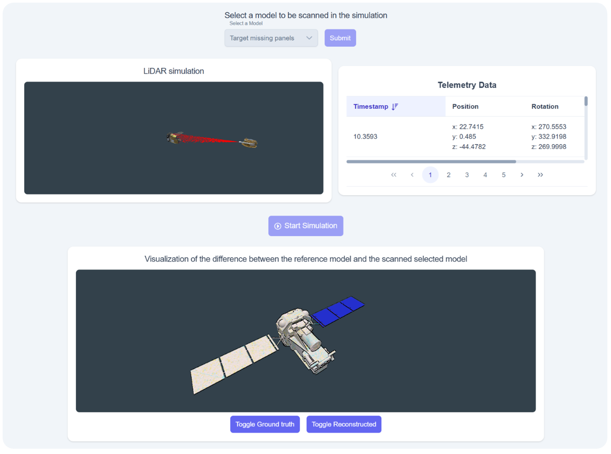
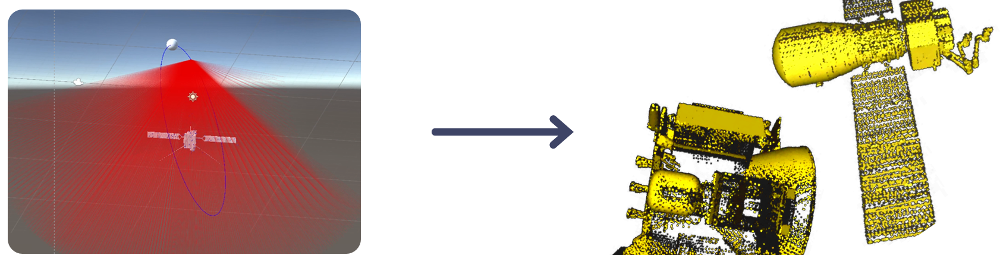
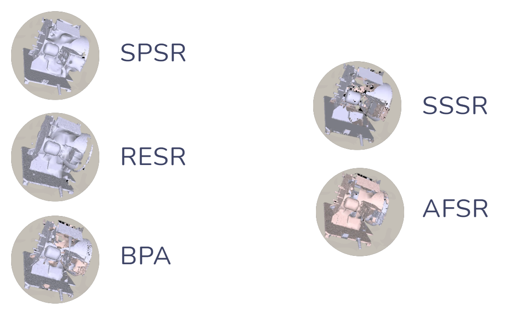
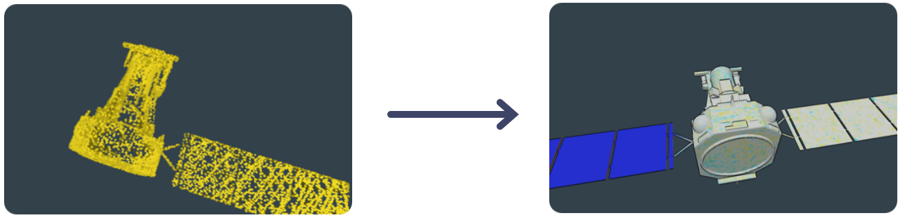
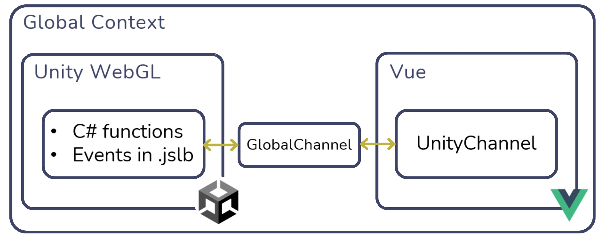

# 3D Reconstruction and Visualization Tools

This project is a collection of tools designed to support the complete workflow of **3D reconstruction and visualization** from LiDAR data, with a particular focus on **web-based applications** in **aerospace scenarios**.  
The framework enables point cloud generation from 3D models, benchmarking and execution of reconstruction algorithms, visual comparison of meshes, and integration of Unity WebGL visualizations into web applications.

Each tool is designed to be modular and can be executed either independently or as part of the integrated demo.  
Every tool includes its own dedicated README with setup and usage instructions.

## 📂 Project Structure Summary

```

├── Demo/                        # Web demo integrating all tools
│   ├── backend/                 # NestJS API
│   └── frontend/                # Vue.js interface
│
├── MeshDifferenceVisualization/
│   ├── PythonPreprocessing/     # Mesh difference computation scripts
│   └── UnityPackage/            # Unity heatmap visualization package
│
├── MeshReconstructionBenchmark/ # Reconstruction algorithm evaluation
│
├── RemeshingTool/               # Optimized Poisson Reconstruction tool
│
├── SyntheticLidarScanning/      # Unity LiDAR simulator for point cloud generation
│
├── UnityWebGLVueLibrary/        # Integration library for Unity WebGL in Vue
│
└── Dockerfile                   # Docker setup for reconstruction and difference tools

```

## 🧭 Project Overview

The framework is composed of multiple submodules:

### **1. Demo**
A complete **web-based demonstration** (frontend + backend) that integrates all tools to showcase a full processing pipeline.

The scenario represents a LiDAR sensor mounted on a spacecraft performing a scan around a satellite.  
The demo allows:
- Real-time visualization of the LiDAR scanning operation.
- Reconstruction of the scanned surface from the generated point cloud.
- Visualization of structural discrepancies between the reconstructed model and the reference CAD.

The web application consists of:
- **Upper panel:** real-time Unity simulation of the scanning process, with telemetry data displayed in an accompanying table.
- **Lower panel:** visualization of the reconstructed mesh and its **heatmap** showing deviations from the reference model.



### **2. SyntheticLidarScanning**

A **Unity-based LiDAR simulator** that generates **synthetic point clouds** from 3D models.  
It reproduces realistic sensor characteristics such as:
- Reduced point density at oblique angles.
- Occlusion and shadow zones caused by model geometry.
- Sensor noise perturbation for increased realism.

The simulator:
1. Loads a 3D model.
2. Moves a virtual sensor along a circular path around the object.
3. Emits rays and records intersections to produce a `.pcd` file.
4. Optionally applies noise models to simulate real-world LiDAR data.

The generated point clouds can be used as input for reconstruction algorithm testing.



### **3. MeshReconstructionBenchmark**

A **benchmarking tool** for evaluating and comparing various **mesh reconstruction algorithms**.  
It automates:
- Point cloud reconstruction using multiple algorithms.
- Metric computation (IoU, Chamfer Distance, Normal Consistency).
- Grid search optimization of algorithm parameters.
- Generation of performance reports.

The framework supports both standard and custom datasets.  
Tests were conducted using five well-known reconstruction methods from literature, including geometric (e.g., **BPA**) and variational approaches (**SPSR**, **RESR**, etc.).



**Results summary:**
- SPSR and RESR produce smoother, more continuous meshes.
- BPA, AFSR, and SSSR generate rougher surfaces.
- SPSR achieved the best balance between quality and computational efficiency.
- Optimal SPSR parameters were exported in JSON format and integrated into a Python wrapper script for easy reuse.


### **4. RemeshingTool**

A lightweight **Python tool** implementing **Poisson Surface Reconstruction (PSR)** using optimized parameters identified by the benchmark.  
It includes:
- A command-line interface for reconstruction.
- Integration with other frameworks via script execution.
- Docker support for reproducibility.


### **5. MeshDifferenceVisualization**

A tool for **visual comparison between reconstructed and reference meshes**, highlighting deviations as a **heatmap** overlay in Unity.

#### **Backend: Python Preprocessing**
- Samples both meshes uniformly.
- Computes bidirectional distances (reference → reconstructed and vice versa).
- Uses normal direction to differentiate cavities and protrusions.
- Maps distances to a color texture for visualization.

#### **Frontend: Unity Visualization**

Structure:
```

MeshDifferenceVisualization/
├── PythonPreprocessing/   # Backend preprocessing scripts
└── UnityPackage/          # Unity package for frontend heatmap visualization

```

- Custom **WebGL-compatible shader** to interpolate distance textures and generate a smooth heatmap.
- Functions exposed to Vue for toggling between the original mesh, reconstructed mesh, and heatmap.
- Efficient **compute shader** implementation avoids performance issues from earlier prototypes.

Example: a missing panel on a satellite would appear as a blue region in the heatmap, indicating missing geometry.



### **6. UnityWebGLVueLibrary**

A **TypeScript library** that simplifies the **integration of Unity WebGL builds into Vue.js applications**.

#### Key Features
- Handles **loading**, **execution**, and **lifecycle management** of Unity WebGL instances.
- Provides **bidirectional communication** between Unity and Vue.

#### Architecture
- Exposes a Vue component `<UnityComponent>` that accepts Unity WebGL build files as input.
- Uses a `<canvas>` element rendered via Vue’s low-level `h()` function for minimal overhead.
- Defines a **GlobalChannel** (accessible from both Unity and Vue) for message exchange.
- Exposes a **UnityChannel** object on the Vue side to:
  - Invoke Unity functions.
  - Subscribe to Unity events.

Unity must include `.jslib` files enabling direct access to `GlobalChannel`.  
A dedicated C# helper class is provided to simplify event publication from Unity scripts.

#### Performance Tests
| Metric | HTML Page | Vue Library |
|--------|------------|-------------|
| Memory usage | 20 MB | 20 MB |
| Page load time | 5.04 s | 5.5 s |
| Framerate | ~100 FPS | ~100 FPS |
| Network time | 1010 ms | 1080 ms |

**Conclusion:** No measurable overhead introduced by the library.  
It supports multiple Unity instances and efficient event listener management via a **Map-based strategy**, optimal for speed and memory usage.



## Docker Integration

The framework includes Docker support to ensure portability and easy execution of the reconstruction and difference computation pipelines.

The resulting files in the docker image are:

- reconstruction: contains reconstruction scripts
- mesh-difference: contains scripts for create textures to visualize difference between two meshes

### Usage - Integration with Docker Compose

#### 1. Create Main Dockerfile

It is necessary to use `build-externals` (that uses node as base image) as image for the Dockerfile in the nestjs (or any node project) service, as it has the necessary
configurations to run the scripts.
e.g. of Dockerfile for nestjs project (or any other node project):

``` Dockerfile
FROM build-externals AS final
WORKDIR /app
#Externals are managed in previous steps
COPY . .
RUN npm install
EXPOSE 3000
```

##### Note

To use this Dockerfile for project that are not based on node it is necessary to edit the `build-externals` Dockerfile base image

#### 2. Create docker-compose

This Dockerfile is designed to be used within a `docker-compose.yml` file. With the goal of building the necessary
scripts and placing them inside `/app/externals`.

Below is an example `docker-compose.yml` configuration to insert the scripts in a nestJS app:

```yaml
services:
  nestjs:
    build:
      context: .
      dockerfile: Dockerfile
    ports:
      - "3000:3000"
    depends_on:
      - externals-scripts
    volumes:
      - .:/app
      - /app/node_modules
      - externals-volume:/app/externals/reconstruction/PoissonRecon
    environment:
      - NODE_ENV=development
    command: [ "npm", "run", "start:dev" ]

  externals-scripts:
    # This service is used only to create an image used by the nestjs service
    # It won't be used as a running container
    image: build-externals
    build:
      context: ./externals
      dockerfile: Dockerfile
    volumes:
      - externals-volume:/app/externals

volumes:
  externals-volume:
```

### Scripts usage within the Docker Volume

Once the Docker container is built, the provided scripts for **Poisson Reconstruction** and **Mesh
Difference Calculation** can be executed from the `nestjs` service within the Docker Compose setup.

#### **Poisson Reconstruction**

The Poisson reconstruction script is located at:

```
/app/externals/reconstruction/reconstruct.py
```
and the Poisson Recon exe is in:
```
/app/externals/PoissonRecon/Bin/Linux/PoissonRecon
```

To execute it from Nest.js, the following approach could be used:

```typescript
const reconstructScript = '/app/externals/reconstruction/reconstruct.py';
const poissonReconExe = '/app/externals/reconstruction/PoissonRecon/Bin/Linux/PoissonRecon';
const inputMesh = '/app/resources/input_mesh.obj';
const outputMesh = '/app/resources/output_mesh.obj';
const depth = 10;
const boundary = 2;

const args = [
  reconstructScript,
  '--poisson_recon_exe', poissonReconExe,
  '--input', inputMesh,
  '--out', outputMesh,
  '--depth', depth.toString(),
  '--bType', boundary.toString(),
];

try {
  await spawnAsync('python', args);
  console.log('Poisson reconstruction completed');
} catch (error) {
  throw new Error(`Poisson reconstruction failed: ${error}`);
}
```

#### **Mesh Difference Calculation**

The mesh difference script is located at:

```
/app/externals/mesh-difference/calculate_difference.py
```

To execute it from Nest.js, the following approach could be used:

```typescript
const meshDiffScript = '/app/externals/mesh-difference/calculate_difference.py';
const sourceMesh = '/app/resources/ground_truth.obj';
const targetMesh = '/app/resources/output_mesh.obj';
const outputDir = '/app/resources/diff_results';

const args = [
  meshDiffScript,
  '--source_path', sourceMesh,
  '--target_path', targetMesh,
  '--output_path_dir', outputDir,
  '--texture_dim', '2048',
  '--samples', '100000',
  '--icp',
  '--simplify',
];

try {
  await spawnAsync('python', args);
  console.log('Mesh difference calculation completed');
} catch (error) {
  throw new Error(`Mesh difference calculation failed: ${error}`);
}
```

### Note
More details on the script parameters and execution are available in the READMEs inside the `reconstruction` and `mesh-difference` tools folders

## Dockerfile Implementation Documentation

<details>

<summary>Docker file implementation details</summary>

### Build Stages

The Dockerfile uses a multi-stage build:

#### **Stage 1: Base Image (Node.js & Essential Tools)**

- Uses `node:22` as the base image.
- Installs system dependencies such as `build-essential`, `cmake`, and `libgl1`.
  This stage could be customized to pull any other image from docker hub (e.g. python, ubuntu, ...)

#### **Stage 2: Python Dependencies**

- Uses `python:3.11-slim` to install Python dependencies.
- Configures environment variables for Python optimization.
- Installs `pipenv` for dependency management.
- Installs dependencies from `Pipfile`.

#### **Stage 3: Move Python dependencies to base image**

- Extends the base image by copying the Python virtual environment from Stage 2.
- Ensures Python is properly linked within the container.
- Copies project files into `/app/externals`.

#### **Stage 4: Poisson Surface Reconstruction Setup**

- Installs additional system libraries needed for Poisson reconstruction.
- Changes the working directory to `PoissonRecon`.
- Builds the Poisson reconstruction binary.

</details>


## Integration Workflow

1. **Generate point clouds** → via `SyntheticLidarScanning`
2. **Benchmark reconstruction algorithms** → via `MeshReconstructionBenchmark`
3. **Execute reconstruction** → via `RemeshingTool`
4. **Compute mesh differences** → via `MeshDifferenceVisualization`
5. **Visualize results in web demo** → via `Demo` (using `UnityWebGLVueLibrary`)


## Additional Documentation

Each tool includes its own README file providing detailed setup, dependencies, and usage instructions.
